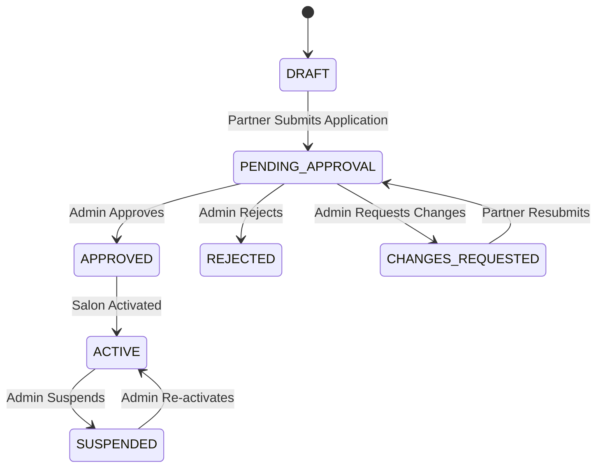

# Salon Onboarding & Approval Workflow - SLOT Platform

## Lifecycle States

```mermaid
stateDiagram-v2
    [*] --> DRAFT
    DRAFT --> PENDING_APPROVAL: Partner Submits Application
    PENDING_APPROVAL --> APPROVED: Admin Approves
    PENDING_APPROVAL --> REJECTED: Admin Rejects
    PENDING_APPROVAL --> CHANGES_REQUESTED: Admin Requests Changes
    CHANGES_REQUESTED --> PENDING_APPROVAL: Partner Resubmits
    APPROVED --> ACTIVE: Salon Activated
    ACTIVE --> SUSPENDED: Admin Suspends
    SUSPENDED --> ACTIVE: Admin Re-activates
```

Every state transition is stored in `salon_approval_history` and logged in `audit_logs` with admin ID and reason.
